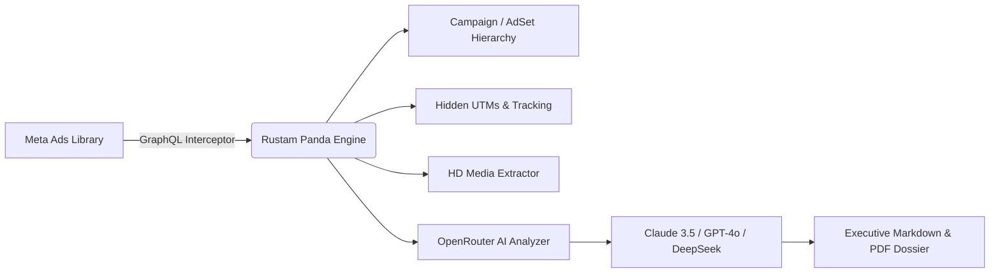

<div align="center">

# 🐼 Rustam Panda
### Meta Ads Library Intelligence & AI Competitor Dossier Engine

<p align="center">
  
</p>

**Forensic Meta AdSpy tool built for performance media buyers, copywriters, and competitive intelligence analysts.**

[](https://developer.chrome.com/docs/extensions/mv3/intro/)
[](https://openrouter.ai/)
[](https://t.me/abbyisonline)
[](https://opensource.org/licenses/MIT)
[](https://t.me/abbyisonline)

<br/>

[Key Features](#-key-features) •
[AI Intelligence](#-ai-competitor-intelligence-analyzer) •
[Folder Hierarchy](#-campaign--adset--ad-folder-tree) •
[Installation](#-installation-guide) •
[Project Structure](#-project-structure) •
[Security](#-privacy--security)

</div>

---

## 🌟 Overview

**Rustam Panda** is an ultra-fast, client-side Chrome Extension (Manifest V3) that turns the **Meta Ads Library** into an unfair competitive advantage. 

Unlike basic scrapers, **Rustam Panda** directly intercepts Meta's internal GraphQL payloads (`AdLibrarySearchPaginationQuery`), reverse-engineers hidden UTM parameters into full **Campaign ➔ AdSet ➔ Ad Creative folder hierarchies**, extracts raw HD MP4 video media, and runs deep **AI Competitor Intelligence Teardowns** using live OpenRouter models.



---

## ⚡ Key Features

| Capability | What It Does | Why It Wins |
| :--- | :--- | :--- |
| 🧠 **AI Competitor Dossier** | Connects to **OpenRouter** (Claude 3.5 Sonnet, GPT-4o, DeepSeek V3/R1, Gemini Flash) | Generates executive hook breakdowns, avatar pain points, and 3 counter-ads |
| 📁 **Campaign ➔ AdSet ➔ Ad Tree** | Reconstructs complete advertising folder structure | Reveals audience angles, testing funnels, and ad creative grouping |
| 🕵️ **Funnel & UTM Unmasker** | Strips Meta's redirect wrappers (`l.facebook.com`) | Uncovers hidden `utm_campaign`, `utm_content`, and destination landing pages |
| ⏱️ **Evergreen Winner Detection** | Computes exact live lifespan in days | Instantly isolates proven scaling winners (`🔥 >21 Days Active`) |
| 🎬 **1-Click HD MP4 Downloader** | Extracts uncompressed video and image assets | Download full-quality ad creatives without third-party watermarks |
| 📄 **Interactive PDF Generator** | Formats reports with typography, tables, and print styles | Download executive PDF intelligence dossiers ready for client presentations |
| 🔒 **Permanent Key Storage** | Uses `chrome.storage.sync` & `chrome.storage.local` | Enter your OpenRouter key **once**; stays synced across all tabs & browser restarts |
| 🎨 **Moody White & Dark Themes** | Curated alabaster/tobacco palette | Crisp contrast, zero cheap button drop-shadows, sleek minimalist UI |

---

## 🧠 AI Competitor Intelligence Analyzer

Powered directly by **OpenRouter**, Rustam Panda feeds deep metadata into leading frontier models to generate actionable strategic blueprints:

### Supported Models
- **⭐ Top Recommended**:
  - `anthropic/claude-3.5-sonnet` (Deep Strategic Logic & Creative Direction)
  - `openai/gpt-4o` (Flagship Reasoning)
  - `openai/gpt-4o-mini` (High-Speed & Cost-Efficient)
  - `google/gemini-2.0-flash-001` (Superfast Processing)
  - `deepseek/deepseek-chat` (DeepSeek V3 • Top Value)
  - `deepseek/deepseek-r1` (Deep Multi-Step Reasoning)
  - `meta-llama/llama-3.3-70b-instruct` (Open Weights Flagship)
  - `mistralai/mistral-large-2411` (European Flagship)
- **🌐 460+ Live Models**: Click **`Fetch Models`** right in the UI to dynamically query OpenRouter's live model registry.
- **⚙️ Custom Model Slug**: Enter any hosted slug (e.g. `anthropic/claude-3.7-sonnet:thinking`).

### Strategic Frameworks Included
1. 🎯 **Full Competitor Strategy & Counter-Plan**:
   - Executive Positioning & Core Value Prop
   - Target Customer Personas & Pain Points Exploited
   - Winning Hooks & Psychology Matrix
   - Funnel & Landing Page Teardown
   - **3 Ready-to-Run Counter-Ad Scripts** (Hook, Script, Visual Direction)
2. ✍️ **Copywriting & Hook Psychological Matrix**:
   - Emotional urgency triggers, curiosity hooks, and headline formulas.
3. 🏆 **Evergreen Scaling Blueprint**:
   - Deconstructs why their longest-running ads continue scaling without creative fatigue.
4. ⚙️ **Custom System Prompt**:
   - Fully editable system prompt editor to tailor analyses to your exact agency workflow.

---

## 📁 Campaign ➔ AdSet ➔ Ad Creative Folder Tree

Most ad spies dump thousands of disjointed creatives into a flat list. **Rustam Panda** parses:
- `trackingInfo.params.utm_campaign` ➔ Campaign Grouping
- `trackingInfo.params.utm_content` & `utm_term` ➔ AdSet Angle / Audience Segment
- `collation_id` & `collation_count` ➔ Dynamic Creative Variants

```
📁 Campaign: [Scale] Q3_Cold_Broad_Conversion
   └── 📂 AdSet: UGC_Problem_Agitation_Angle
       ├── 📄 Creative #1 (UGC Hook: "Stop doing this...", 42 days active) 🔥
       ├── 📄 Creative #2 (Product In-Action, 38 days active) 🔥
       └── 📄 Creative #3 (Before / After Comparison, 29 days active)
   └── 📂 AdSet: Founder_Story_Angle
       ├── 📄 Creative #4 (Founder Origin, 15 days active)
       └── 📄 Creative #5 (Behind The Scenes, 12 days active)
```

---

## 🎨 Moody White-Base & Dark Obsidian Aesthetic

Designed from the ground up to feel like a high-end luxury terminal:
- **Base Theme**: Warm Alabaster White (`#fbfaf8`, `#ffffff`) with deep charcoal typography (`#1c1917`).
- **Accent**: High-contrast tobacco cognac (`#8d4925`, `#713516`) with razor-sharp contrast.
- **Zero Cheap Shadows**: Clean hairline borders (`border: 1px solid var(--adspy-border)`) and flat modern buttons instead of tacky blurry drop shadows.
- **1-Click Theme Switcher**: Toggle effortlessly between **Moody White Base** and **Moody Obsidian Dark**.

---

## 🚀 Installation Guide

### Option A: Install from Local Directory (Recommended)

1. Clone or download this repository:
   ```bash
   git clone https://github.com/ulixtech/Rustam-Panda.git
   ```
2. Open **Google Chrome** and navigate to:
   ```text
   chrome://extensions/
   ```
3. Enable **Developer mode** (toggle switch in the top-right corner).
4. Click the **Load unpacked** button in the top-left corner.
5. Select the `rustam-panda` (or `adspy`) project folder.
6. Pin **🐼 Rustam Panda** to your Chrome toolbar for quick access!

---

## 💡 Quick Start Walkthrough

1. Go to any page on [Meta Ads Library](https://www.facebook.com/ads/library/).
2. Look for the floating **`🐼 Rustam Panda`** pill in the lower-right corner.
3. Click the pill to open the studio drawer.
4. Click **`⚡ Auto-Scroll & Collect`** to hands-free capture competitor ads.
5. Switch between:
   - **🎴 Cards View**: Grid of ads with media downloaders and lifespan tags.
   - **📁 Campaign Folders**: Full folder hierarchy view.
   - **🧠 AI Insights**: Run automated competitor teardowns with Claude 3.5, GPT-4o, or DeepSeek!
6. Click **`🖨️ Export as PDF`** to open the dedicated printable dossier generator.

---

## 🗂️ Project Structure

```
├── manifest.json         # Manifest V3 configuration & permissions
├── interceptor.js        # MAIN world GraphQL network interception hook
├── content.js            # Core engine, drawer overlay, AI caller & folder tree
├── overlay.css           # Moody design system, tokens, and drawer styling
├── popup.html            # Extension popup with permanent API key manager
├── popup.js              # Popup controller & chrome.storage synchronization
├── popup.css             # Extension popup styling (moody white palette)
├── report.html           # Dedicated printable PDF dossier generator
├── report.js             # Markdown parser & print formatting logic
├── icons/                # High-resolution extension branding & panda avatar
│   ├── icon16.png
│   ├── icon48.png
│   ├── icon128.png
│   └── panda.jpg
├── .gitignore            # Git exclusion rules
├── LICENSE               # MIT License
├── CONTRIBUTING.md       # Contribution guidelines
└── SECURITY.md           # Privacy & local storage security policy
```

---

## 🔒 Privacy & Security

- **Direct Client-to-API**: Your OpenRouter API key communicates directly with `https://openrouter.ai/api/v1/chat/completions`.
- **Zero Remote Tracking**: No external analytics, telemetry, or third-party servers are used.
- **Permanent Chrome Storage**: Keys are stored locally inside `chrome.storage.sync` and `chrome.storage.local`.

---

## 👨‍💻 Author & Connect

Developed with precision and obsession by **[@abbyisonline](https://github.com/abbyisonline)**.

💬 **Telegram**: [@abbyisonline](https://t.me/abbyisonline) — *Direct message for feature requests, bug reports, custom media buying tooling, or collaboration.*

---

## 📄 License

This project is licensed under the [MIT License](LICENSE) - feel free to use, modify, and distribute.
